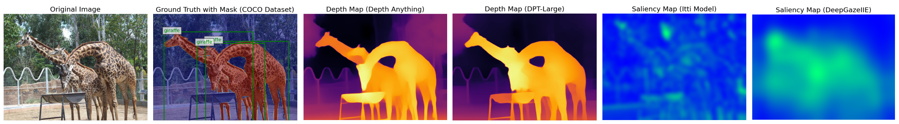
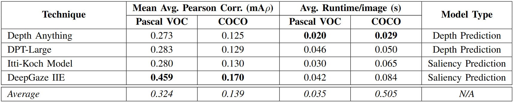

# Correlation of Object Detection Performance with Visual Saliency and Depth Estimation

> <h2> Matthias Bartolo, Dylan Seychell </h2>
> <h3> Department of Artificial Intelligence, University of Malta </h3>

  

## Abstract

<i>
As object detection techniques continue to evolve, understanding their relationships with complementary visual tasks becomes crucial for optimising model architectures and computational resources. This paper investigates the correlations between object detection accuracy and two fundamental visual tasks: depth prediction and visual saliency prediction. Through comprehensive experiments using state-of-the-art models (DeepGaze IIE, Depth Anything, DPT-Large, and Itti's model) on COCO and Pascal VOC datasets, we find that visual saliency shows consistently stronger correlations with object detection accuracy (mAρ up to 0.459 on Pascal VOC) compared to depth prediction (mAρ up to 0.283). Our analysis reveals significant variations in these correlations across object categories, with larger objects showing correlation values up to three times higher than smaller objects. These findings suggest incorporating visual saliency features into object detection architectures could be more beneficial than depth information, particularly for specific object categories. The observed category-specific variations also provide insights for targeted feature engineering and dataset design improvements, potentially leading to more efficient and accurate object detection systems.
</i>

## Depth Prediction

  

## Saliency Prediction

  

## Results

  

